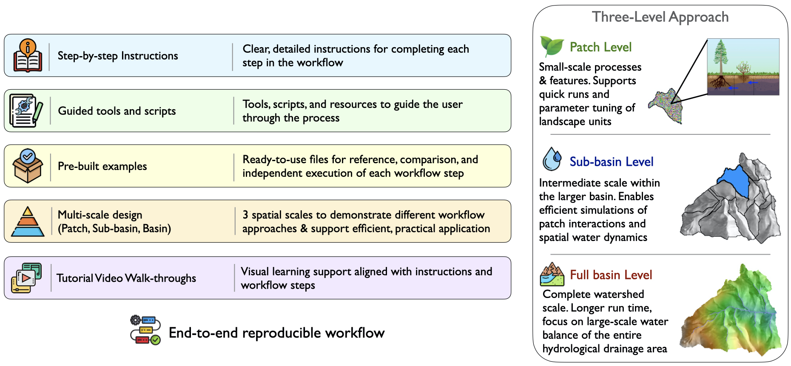

# Welcome

## Purpose

-   About the manual, why it exists, what it is for

## Intended Audience

-   Who this is for/Who should be reading this
-   Assumed prerequisite knowledge (i.e. assumes basic knowledge of...provide links to resources where appropriate)
    -   General Modeling
    -   Basic R/Rstudio
    -   GIS and Raster/Vector
    -   Basic Unix/Linux environment (shell, command line, text editor)
    -   Git/GitHub

## Scope

-   What to expect from this book (user will learn....)
-   What the manual covers (practical step-by-step guidance)
-   What it does not cover (underlying theory of the model, all possible functionality)

## Conventions (potentially)

-   How to read this document
-   Key/Legend for document formatting - regarding use of icons, symbols, different font indications

## Manual Structure

-   organization
-   navigation
-   links to sections
-   potentially a link to a quick start guide

## Support/Resources

-   Potentially include author info (Naomi, Janet (contact info?), Ryan)
-   RHESSys GitHub repositories (RHESSys code, RHESSysPreProcessing, RHESSysIOinR, ParameterLibrary)
-   RHESSys Wiki(s)
-   Potentially a FAQ page, a user community forum (i.e. 'issues' section on RHESSys Github repo?)

# [[Part I: Foundations & Environment]{.underline}]{style="color:blue;"}

-   This part is about understanding the logic of this tool and setting the computational environment
-   intro to what is covered in the section
-   expected outcome for this section: functioning modeling environment and clear strategic plan

# 1 Introduction (The Model)

## 1.1 Overview of RHESSys

### What RHESSys is

-   Description

#### Capabilities

-   Integrated Ecohydological Modeling
-   Spatial distribution of the landscape
-   Feedback loops
-   Fire model

#### Limitations

-   High data demands
-   Can be computationally intensive
-   Maybe any processes that are not well represented? Let users know if the model won't fit their research question

## 1.2 Recommended reading/Publications

-   Foundational papers
-   Overview/Review papers
-   Applications

## 1.3 Workflow overview

{fig-alt="RHESSys Modeling Workflow Overview" width="1000"}

-   Step 1: Installation - Set up the RHESSys environment
-   Step 2: Data Preparation - Gather and format spatial, climate, and validation data
-   Step 3: Preprocessing - Generate the landscape representation (Worldfile) and routing (Flowtable) input files
-   Step 4: Model Setup and Execution - Define the simulation rules and run RHESSys
-   Step 5: Calibration & Sensitivity Analysis - Condition the model (Initialize/reach equilibrium), refine parameters, validate performance
-   Step 6: Post Processing - wrangle, analyze, and visualize output data

### Key concepts and terminology

(define frequently used terms)

-   Spatial hierarchy (basin, hillslope, zone, patch, stratum)
-   Input File types (Worldfile, Header, Flowtable, Tecfile, Parameter/Climate files, Output filters)
-   State variables (store quantities) and fluxes
-   Spatial/Temporal step (i.e., basin daily, patch monthly)

# 2 Setup (The Software)

## 2.1 Setup options

(description of each, who should use, when to use, recommendation, link to corresponding install instructions)

### 2.1.1 Local Installation (MacOS, Linux)

-   more advanced users
-   users who want more flexibility

### 2.1.2 Containerized setup (Docker)

-   beginners
-   Windows users
-   portability

### 2.1.3 HPC/Cloud (SIF/Singularity)

-   high-performance computing environments
-   cluster users
-   large scale, high resolution simulations

## 2.2 RHESSys Installation

### 2.2.1 MacOS (include section for Linux as well if necessary or where differs)

#### Code Dependencies and Operational Requirements

-   Terminal application
-   Xcode Command Line Tools (compilers/build tools)
-   Privileges (i.e. Administrator access)
-   Homebrew
-   Git
-   Libraries (i.e. NetCDF)

#### Installation steps

-   Download code from GitHub
    -   Zip file
    -   Clone repository (main, develop)
-   Compile
-   Shell configuration (adding to path)
-   Verify installation
-   Common issue and solutions

### 2.2.2 Docker

-   Install Docker Desktop
-   Obtaining RHESSys image from the Docker Hub

### 2.2.3 SIF

-   Obtaining RHESSys .sif image

## 2.3 Installing Workflow & Analysis Tools

### 2.3.1 R Ecosystem

-   R (The engine)
-   RStudio (The interface)
-   Standard Packages (Extensions - Libraries that expand functionality)

### 2.3.2 WhiteboxTools for Geospatial Processing

### 2.3.3 RHESSys-Specific R packages

-   RHESSysPreprocessing
-   RHESSysIOinR

# 3 Project Design & Planning (The Strategy)

-   will discuss what a user should consider, i.e.:

## 3.1 Spatial resolution vs. computational cost

-   patch resolution/number of patches impact on processing needs & time
-   scale - what is necessary to answer users questions: is fine-scale processing necessary?

## 3.2 Data synchronization & temporal extent

-   overlap - i.e., does the temporal period of climate data & observed streamflow data conincide?
-   spin-up and calibration time requirements

## 3.3 Functional constraints

-   Feature specific inputs - i.e. to run the fire model, is wind speed/direction and relative humidity data available?
-   Does RHESSys output what is needed to answer research questions?

## 3.4 Defining the project boundaries

-   use full basin boundary, representative hillslope, single patch?

# 4 Example Dataset (The Sandbox)

{fig-alt="Instructional System Design" width="1000"}

## 4.1 Study Site Overview

-   Location
-   Characteristics

## 4.2 Dataset Contents

-   Raw Data: spatial (and workflow file to generate rasters), formatted climate and observational data
-   Preprocessing data: Workflow script, all prerequisite files necessary for generating Worldfile/Flowtable, and completed Worldfiles and Flowtables (for a patch, hillslope, and full basin)
-   Simulation files: Ready-to-run workflow scripts with functions to generate all necessary instruction to run the model for different strategies (i.e., single run, multi-run, for calibration & sensitivity analysis)
-   Reference outputs: Sample model results
-   How to get it

## 4.3 How to use this data

-   Contextual understanding
-   Performance Evaluation - verification for user generated files
-   Troubleshooting
-   Modular learning - start at any step in the manual

# [[Part II: Building and Executing]{.underline}]{style="color:blue;"}

-   This part is about building the model, constructing the foundation for a fuctional simulation
-   expected outcome for this section: creating input in order to run the model, generate output, and interpret results

# 5 User-Acquired Data (The Ingredients)

## 5.1 Spatial Data

-   Required
    -   DEM (source to obtain)
    -   Watershed outlet - gauge location coordinates
        -   DEM Derivatives - generation discussed in later section:
            -   Watershed Basin boundary
            -   Sub-basins (hillslopes)
            -   Slope/Aspect
            -   E/W Horizons
            -   Stream Network
            -   Patches
-   Recommended (typical) or when applicable:
    -   Vegetation cover
    -   Soils
    -   Landcover/Landuse
    -   Roads
    -   Impervious areas
    -   Climate base stations
    -   Aspatial rules ID map for multi-scale routing

## 5.2 Climate Data

-   Timeseries data
-   Required meteorologic data
-   Optional meteorologic data
-   Base station
-   Supported Input Formats - point, grid, NetCDF - and how to format each

## 5.3 Observational Data

-   used to constrain and evaluate hydrologic and ecophysiological parameterization
-   Hydrologic (i.e., Streamflow, Snow, Soil moisture)
-   Vegetation (i.e, LAI, Height, NPP, ET, rooting depth)

# 6 RHESSys-specific Input Files (The Anatomy)

## 6.1 Definition (Default) Files: The Library

-   About
-   File types association with each level
    -   some parameters may need expanded information, i.e. phenolog flag: static,dynamic,drought
-   Format - required (ID) and optional parameters
-   Parameter values constant
-   Base Files/Default values
-   Parameter file library

## 6.2 Worldfile: The Spatial Blueprint

-   Hierarchical spatial containment structure - landscape partioning
    -   Basin
    -   Hillslope (sub-basin)
    -   Zone
    -   Patch, Patch Families/Asptatial patches for multiscale routing
    -   Stratum
-   Architecture
-   Identifiers: Pointers (ID's) linking identifiers to the Climate and Definition files
-   State variables, values for stores/fluxes associated with each level
-   Header File - conduit between the Worldfile and Climate/Definiton files

## 6.3 Flowtable: The Pumbing

-   Architecture
-   Topographic data about each patch
-   Routing, Patch connectivity, neighbors
-   Partitioning flow, upland patches, stream patches

## 6.4 Tecfile and Output Filters: Simulation Control

### 6.4.1 Tecfile: The Alarm Clock

-   Manage timing of output printing
-   Control simulation events (schedule when non-continuous events occur, i.e. fire, land use change)
-   Trigger a worldfile redefinition to update properties of the landscape

### 6.4.2 Output filters: The Sieve

-   specify criteria for selecting and filtering the output data
-   Filter rules
-   Filter conditions
-   Filter Parts: timestep, spatial level, output format/name
-   Variables associated with Spatial/Temporal leval of output
    -   sub-level output
    -   sub-routine output
-   Variable reassignment: name reassignment, arithmetic expressions

# 7 Preprocessing (The Foundation)

## 7.1 Environmental Setup

-   Standard directory structure
-   naming convention

## 7.2 Raster Processing

-   Spatial processing using WhiteboxTools and R

## 7.3 Generating the Worldfile and Flowtable

### 7.3.1 The Template File: Recipe for the worldfile

-   Format and Initialization
    -   World objects
    -   State variables
    -   Default and base station ID's
-   Required and Optional state variables
-   Redefinition template (introduce here or later in advanced?)
-   Editing the template, initial conditions

### 7.3.2 Aspatial rules file for Multi-scale routing

-   Format
-   Set up for single rule
-   Set up for multiple rules - requires map

### 7.3.3 RHESSysPreprocessing R package

-   About
-   Prerequisites: spatial data, template, asp rules file if applicable
-   R markdown workflow/script - functions
-   Run the function to generate Worldfile/Flowtable

# 8 RHESSys Implementation & Execution (The Ignition)

-   Define the simulation rules
    -   RHESSysIOinR Functions to provide the directions necessary to run RHESSys
-   Output filter design
    -   Tecfile/Output Filter interaction for expected output
    -   Selecting RHESSys output variables
        -   Choosing variables relevant to the research questions and analysis goals
        -   Reassigning/Combining variables
-   Executing simulations in R
    -   Single run
    -   Multiple runs

# 9 Post-processing (The Insight)

-   Output data wrangling - reading output into R, synthesizing, transforming, rearranging data for use-case
-   Analyzing
-   Visualizing

# [[Part III: Refinement and Evaluation]{.underline}]{style="color:blue;"}

-   This part is about moving from just a running model to a credible scientific tool.
-   intro to what is covered in the section
    -   the iterative cycle - cyclincal refinement loop
    -   include a figure/diagram/flowchart about the feedback loop
    -   refinement not linear path - changing one parameter may require re-balancing the system
    -   each phase informs the next - often requiring return to previous step
-   expected outcome for this section: learning the process to ensure a balanced system

# 10 Initialization (The Equilibrium)

-   Spin-up/Initializing approaches
-   Achieving steady-state
-   Spin-up Tec event
-   State-of-the world output Worldfile
-   Typical spin-up output variables
-   Determining baseline equilibrium

# 11 Sensitivity Analysis (The Influence)

-   Identifying influential variables - understanding the 'knobs', which to turn
-   Parameter Space Characterization (establishing realistic bounds/ranges)
-   Parameter Selection

# 12 Calibration (The Optimization)

-   Methodology
-   Optimization Workflows - (corresponding with 'real world' observations)
-   Objective Functions and Performance Metrics
-   The challenge of equifinality

# 13 Validation (The Verification or The Credibility)

-   judging/evaluation performance
-   testing calibrated parameters against data set independent of calibration period

# [[Part IV: Advanced Application]{.underline}]{style="color:blue;"}

-   This part is about exploring complex eco-hydrological scenarios
-   intro to what is covered in the section
-   expected outcome for this section: ability to move from model development to high impact scientific inquiry

# 14 Advanced Features (The Expansion)

-   beyond the baseline
-   moving into specialized simulations

## 14.1 Disturbance modeling

-   disturbance in RHESSys: altering the carbon cycles and redirecting the flow of water and nutrients from the baseline
-   predicting ecosystem resilience and recovery over time

### 14.1.1 Fire Spread and Fire Effects

-   about
-   compiling RHESSys-WMFire: Boost/WMFire library
-   Prerequisites to running the fire model:
    -   Wind speed and direction data
    -   Fire definition file parameters
        -   calculating the fire return interval
        -   calculating wind parameters (EstimateWindDistrExample.R script)
    -   Fire effects parameters in vegetation and soil(patch) definition files
    -   Worldfile header edits
    -   Add worldfile state variable
    -   Command line option
-   Outputs
    -   fire write parameter generated output
    -   spatial level fire outputs and specific fire effects output files
-   stochastic
-   prescribed

### 14.1.2 Land Cover/Vegetation change

-   biomass pool changes
-   drought induced mortality
-   fuel treatments
    -   thinning, controlled burns
-   redefine world functionality (redefine_world\_: multiplier, thin_remain, thin_harvest, thin_snags, thin_harvest)

## 14.2 Multi-scale routing - fine-scale heterogeneity

-   not sure this belongs in advanced features anymore because it has become pretty standard, and I have introduced it above
-   this can be debated!

## 14.3 Target-driven spin-up

-   advanced method of spin-up to reach varying stages of observed ecological states
-   run to reach spatially explicit targets, i.e. LAI
-   types of spin-up targets
-   sources for deriving targets
-   Prerequisites to running:
-   spin-up target file
-   target file header
-   spin-up definition file
-   worldfile with spinup object ID
-   worldfile header pointer
-   command line options

## 14.4 Parallelization (maybe include?)

-   run a large watershed in parallel in order to speed up the simulation process
-   compiling with openmp

# 15 Appendices (The Vault)

-   Command-line functionality
-   History/Legacy tools/functionality
-   Code organization
-   additional items will become clear as I go along!
